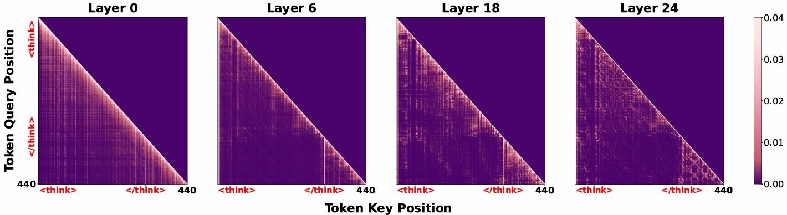
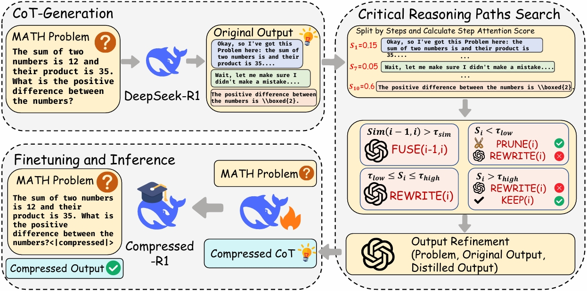

# CRISP: Compressing Redundancy in Chain of Thought via Intrinsic Saliency Pruning

Implementation of ACL 2026 Findings paper `CRISP: Compressing Redundancy in Chain of Thought via Intrinsic Saliency Pruning`.

CRISP is an end-to-end pipeline for:

- generating raw chain-of-thought (CoT) trajectories,
- filtering and sampling high-quality generations for downstream use,
- compressing CoTs with greedy search over `PRUNE`, `KEEP`, `REWRITE`, and `FUSE`,
- optionally refining compressed outputs into LLaMA-Factory-style SFT data,
- visualizing attention patterns on generated CoTs.

## ✨ Highlights

- `step1`: generate raw CoT with `vLLM`
- `step1.5`: filter step1 outputs by correctness and length, then sample by difficulty level
- `step2`: greedy-search CoT compression with attention scoring and semantic-similarity gating
- `step3`: API-based refinement and export to LLaMA-Factory JSON
- `attention_plot`: per-layer attention heatmaps for generated CoT samples

## 👀 Attention Analysis

`attention_plot/attention_analysis.sh` visualizes token-level attention for a single sample. You can run it directly with the bundled demo data in `example_data/`, so it does not require finishing `step1` first.

Quick demo with the bundled example data:

```bash
CUDA_VISIBLE_DEVICES=0 \
bash attention_plot/attention_analysis.sh pretrained_model/DeepSeek-R1-Distill-Qwen-7B
```

Custom input JSONL:

```bash
CUDA_VISIBLE_DEVICES=0 \
MODEL_PATH=/path/to/your/model \
DATA_PATH=/path/to/your_input.jsonl \
OUTPUT_DIR=/path/to/attention_output \
SAMPLE_ID=0 \
LAYERS=0,6,18,24 \
bash attention_plot/attention_analysis.sh
```

Notes:

- `MODEL_PATH` is required and must exist locally.
- If `DATA_PATH` is omitted and the model name contains `1.5B` or `7B`, the wrapper automatically uses the matching file in `example_data/`.
- `DATA_PATH` can also point to your own JSONL file, including a step1 output file if you want to analyze your own generations.
- The script writes heatmaps under `${OUTPUT_DIR}/sample_${SAMPLE_ID}/img/`.

Example attention visualization:



## 🗺️ CRISP Pipeline

The figure below summarizes the end-to-end CRISP workflow from raw CoT generation to refined SFT training data.



## 📦 Repository Layout

```text
.
|-- attention_plot/
|   |-- attention_analysis.py
|   `-- attention_analysis.sh
|-- example_data/
|   |-- gsm8k_sample_1.5B.jsonl
|   `-- gsm8k_sample_7B.jsonl
|-- figures/
|   |-- attention_plot.png
|   `-- crisp.png
|-- llamafactory_example/
|   |-- deepspeed/
|   |-- qwen_1_5b_full_sft.yaml
|   |-- qwen_7b_full_sft.yaml
|-- scripts/
|   |-- step1_cot_generation.sh
|   |-- step1.5_prepare_dataset.sh
|   |-- step2_run_greedy_search_compression.sh
|   `-- step3_run_output_refinement.sh
|-- src/
|   |-- compression_utils.py
|   |-- step1.5_prepare_dataset.py
|   |-- step1_cot_generation.py
|   |-- step2_greedy_search_compression.py
|   `-- step3_output_refinement.py
|-- utils/
|   |-- answer_extraction.py
|   |-- filter_train_dataset.py
|   `-- ...
|-- requirements.txt
`-- README.md
```

## 🚀 Setup

```bash
conda create -n CRISP python=3.10 -y
conda activate CRISP
pip install -r requirements.txt
```

## 🧩 Data Expectations

`step1` expects a parquet dataset with the same schema as `math_full_minus_math500`. The key columns are:

- `problem`
- `answer`
- `solution`
- `level`
- `type`
- `unique_id`

You can pass either:

- a dataset root containing `data/train-00000-of-00001.parquet`, or
- the parquet file path directly.

## ⚙️ Pipeline

### 1. Generate Raw CoT

```bash
MODEL_PATH=/path/to/your/model \
DATA_PATH=/path/to/dataset_root_or_parquet \
OUTPUT_BASE_PATH=/path/to/output \
TENSOR_PARALLEL_SIZE=4 \
bash scripts/step1_cot_generation.sh
```

Optional environment variables:

- `NUM_SAMPLES`: limit the number of processed samples

Output:

- `${OUTPUT_BASE_PATH}/${MODEL_NAME}/math_full_minus_math500_cot.jsonl`

Each JSONL record contains fields such as `question`, `prompt`, `full_output`, `ground_truth`, `sample_id`, `level`, and `output_token_count`.

### 1.5. Filter and Sample Step1 Outputs

This step keeps only correct step1 generations shorter than `MAX_LENGTH`, then samples up to `NUM_PER_LEVEL` records for each level from `Level 1` to `Level 5`.

```bash
INPUT_PATH=/path/to/step1_output.jsonl \
OUTPUT_PATH=/path/to/prepared.jsonl \
NUM_PER_LEVEL=500 \
MAX_LENGTH=8192 \
bash scripts/step1.5_prepare_dataset.sh
```

Optional environment variables:

- `TOKENIZER_PATH`: only needed when the input JSONL does not already contain output token counts
- `SEED`: random seed for per-level sampling
- `NUM_SAMPLES`: debug limit on how many records to inspect

Notes:

- `INPUT_PATH` can be either a step1 JSONL file or a directory containing exactly one `*_cot.jsonl`.
- `OUTPUT_PATH` can be either a `.jsonl` file or a directory. When a directory is given, the script writes `{input_name}_prepared.jsonl`.
- `src/step1.5_prepare_dataset.py` is a thin wrapper over `utils/filter_train_dataset.py`.

### 2. Run Greedy-Search Compression

This step reads the prepared JSONL, computes attention-based step scores, and compresses each CoT with greedy search.

```bash
OPENAI_API_KEY=your_api_key \
MODEL_PATH=/path/to/your/model \
INPUT_FILE=/path/to/prepared.jsonl \
OUTPUT_DIR=/path/to/output \
SIMILARITY_MODEL_PATH=/path/to/simcse_or_sentence_embedding_model \
API_MODEL=your-api-model \
bash scripts/step2_run_greedy_search_compression.sh
```

Important behavior:

- `SIMILARITY_MODEL_PATH` is always required.
- The shell wrapper defaults to `ENABLE_REWRITE=1` and `ENABLE_FUSE=1`.
- When `ENABLE_REWRITE=1` or `ENABLE_FUSE=1`, you must set `OPENAI_API_KEY` and `API_MODEL`.
- `OPENAI_BASE_URL` is supported for compatible API endpoints.

To run compression without API-based `REWRITE` and `FUSE`:

```bash
MODEL_PATH=/path/to/your/model \
INPUT_FILE=/path/to/prepared.jsonl \
OUTPUT_DIR=/path/to/output \
SIMILARITY_MODEL_PATH=/path/to/simcse_or_sentence_embedding_model \
ENABLE_REWRITE=0 \
ENABLE_FUSE=0 \
bash scripts/step2_run_greedy_search_compression.sh
```

Useful optional environment variables:

- `TAU_LOW`
- `TAU_HIGH`
- `TAU_SIM`
- `NUM_SHARDS`
- `GPU_IDS`
- `SEED`
- `NUM_SAMPLES`

Output:

- main merged file: `${OUTPUT_DIR}/greedy_compressed.jsonl`
- shard outputs and logs: `${OUTPUT_DIR}/compressed_${INPUT_NAME}/`

Each output record includes `compressed_output`, `compression_ratio`, `num_steps`, `num_kept_steps`, `step_scores`, `action_history`, and `greedy_score`.

### 3. Refine Compressed Outputs into LLaMA-Factory JSON

```bash
OPENAI_API_KEY=your_api_key \
INPUT_FILE=/path/to/greedy_compressed.jsonl \
OUTPUT_FILE=/path/to/refined_sft.json \
REFINE_MODEL=your-api-model \
bash scripts/step3_run_output_refinement.sh
```

Optional environment variables:

- `OPENAI_BASE_URL`
- `NUM_WORKERS`

Output:

- a JSON file ready for LLaMA-Factory-style SFT training

For each compressed sample, the script writes:

- one refined compressed entry with the compression suffix,
- one original uncompressed entry when `original_output` is available.

Example LLaMA-Factory training configs for the step3 outputs live under `llamafactory_example/`.

## 🔧 Utilities

### `utils/filter_train_dataset.py`

Run the same filtering and level-balanced sampling logic as step1.5 directly from Python.

```bash
python utils/filter_train_dataset.py \
  --input_path /path/to/math_full_minus_math500_cot.jsonl \
  --output_path /path/to/prepared.jsonl \
  --num_per_level 500 \
  --max_length 8192
```

### `utils/answer_extraction.py`

Helper functions for math-answer extraction and normalization used by the filtering step.

## 📝 Notes

- `step2_greedy_search_compression.py` loads the base model with `transformers` for attention scoring and reward computation.
- `step1_cot_generation.py` uses `vLLM` and writes one JSONL record per generated sample.
- `step3_output_refinement.py` expects `greedy_compressed.jsonl`-style inputs from step2.
- `example_data/` is intended for smoke tests and attention-plot demos, not for the full training pipeline.

## 📖 Citation

Citation metadata will be added after the public camera-ready release is finalized.
